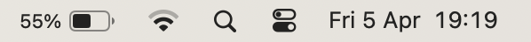

# Setup: \<Object>


Setup checklist for new Android phones.

> **Note:** instructions in this repository have been tested for Samsung phones.

## Contents

<!--
  To generate the table of contents (ToC) with Vim:
    1. Make sure https://github.com/mzlogin/vim-markdown-toc is installed
    2. Execute: :let g:vmt_list_item_char = '- [ ]'
    3. Remove '<DELETE>' from the below comment
    4. Save the file (table of contents is automatically regenerated on save)
    5. Re-add '<DELETE>' to prevent accidential regeneration of ToC 
-->

<!-- DELETE vim-markdown-toc GFM -->

- [ ] [1. Disable opening of links in the Gmail app](#1-disable-opening-of-links-in-the-gmail-app)
- [ ] [2. Disable opening of links in the Google app](#2-disable-opening-of-links-in-the-google-app)

<!-- vim-markdown-toc -->

## 1. Disable opening of links in the Gmail app

1. Go to _**Gmail → Settings → General settings**_
1. Uncheck _**Open web links in Gmail**_

> **Note:** this makes sure that links from Gmail are opened with Chrome, which makes them safer to retrieve when switching apps, etc.

## 2. Disable opening of links in the Google app

1. Go to _**Google → Settings → Other settings**_
1. Uncheck _**Open web pages in the app**_

> **Note:** this makes sure that links from the Google app are opened with Chrome, which makes them safer to retrieve when switching apps, etc.

## X. EXAMPLE: Disable opening of links in Gmail

1. Set _**Foo**_ to _**Bar**_
1. Change the following items to these values:
   | Item      | Value     |
   |:----------|:----------|
   | _**Foo**_ | _**Bar**_ |
   | _**Baz**_ | _**Kux**_ |
1. Execute the following:
   ```bash
   echo foo
   ```
1. See this image:<br />
   

[↑ Top](#contents)

## X. EXAMPLE: Repo reference item


✅ See [**weibeld-setup/_\<repo-name>_**](https://github.com/weibeld-setup/)

[↑ Top](#contents)
