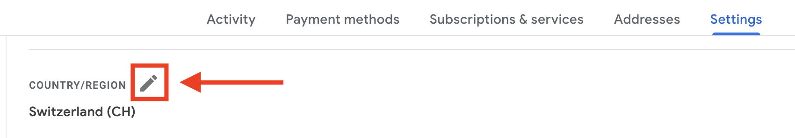
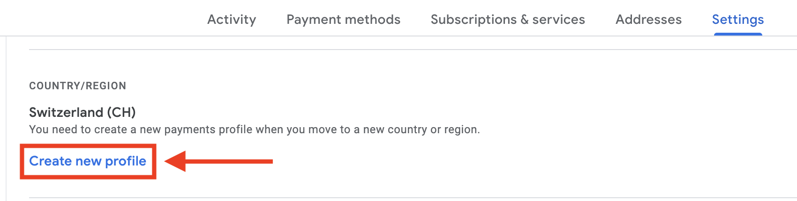
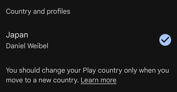
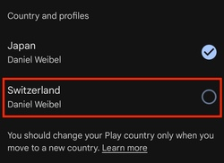
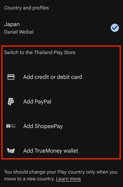

# Setup: Android

Setup checklist for new Android phones.

> **Note:** instructions in this repository have been tested for Samsung phones.

## Contents

<!--
  To generate the table of contents (ToC) with Vim:
    1. Make sure https://github.com/mzlogin/vim-markdown-toc is installed
    2. Execute: :let g:vmt_list_item_char = '- [ ]'
    3. Remove '<DELETE>' from the below comment
    4. Save the file (table of contents is automatically regenerated on save)
    5. Re-add '<DELETE>' to prevent accidential regeneration of ToC 
-->

<!-- vim-markdown-toc GFM -->

- [1. Prevent opening web links in Gmail](#1-prevent-opening-web-links-in-gmail)
- [2. Prevent opening web links in Google](#2-prevent-opening-web-links-in-google)
- [3. Add a dedicated Google account for a desired Google Play country](#3-add-a-dedicated-google-account-for-a-desired-google-play-country)
  - [1. Create a new Google account](#1-create-a-new-google-account)
  - [2. Create a new payments profile for the desired country](#2-create-a-new-payments-profile-for-the-desired-country)
  - [3. Add the new Google account to Android](#3-add-the-new-google-account-to-android)
  - [4. Use the new Google account's payment profile in Google Play](#4-use-the-new-google-accounts-payment-profile-in-google-play)

<!-- vim-markdown-toc -->

## 1. Prevent opening web links in Gmail

1. Open the _**Gmail**_ app
1. Go to _**Settings → General settings**_
1. Uncheck _**Open web links in Gmail**_

> **Note:** this makes sure that clicking on a web link in Gmail causes the link to be opened in Chrome rather than the Gmail app.

[↑ Top](#contents)

## 2. Prevent opening web links in Google

1. Open the _**Google**_ app
1. Go to _**Settings → Other settings**_
1. Uncheck _**Open web pages in the app**_

> **Note:** this makes sure that clicking on a web link in the Google app (e.g. a Google search result) causes the link to be opened in Chrome rather than the Google app.

[↑ Top](#contents)

## 3. Add a dedicated Google account for a desired Google Play country

> This allows installing Google Play apps restricted to the desired country on the phone, while still maintaining the main Google account's Google Play country and payment method. Note that **no credit card** or other payment method from the desired country is necessary.

### 1. Create a new Google account

1. Go to _**<https://accounts.google.com/signup>**_
1. Enter the name and birth date for the new Google account
1. At the email address step, optionally select _**Use your existing email**_ and enter any existing email address to use with the new Google account (instead of creating a new `@gmail.com` address)
1. Complete the account creation wizard

> **Note:** when creating a new Google account, it might also be possible to directly enter an address from the desired country, in which case the following step is not necessary.

### 2. Create a new payments profile for the desired country

1. Log in to _**<https://payments.google.com/>**_ with the new Google account
1. Go to _**Settings → Payments profile**_
1. In the _**Country/Region**_ field, click on the _**Edit**_ icon and then on _**Create new profile:**_
   
   
1. Follow the _**Create a new payments profile**_ dialog:
   1. Under _**Country/Region**_ choose the desired country
   1. Under _**Name and address**_ enter a valid address in the desired country
1. Click _**Submit**_

> **Note:** this can also be done to an existing Google account, in which case the previous step ([_Create a new Google account_](1-create-a-new-google-account)) is not necessary.

### 3. Add the new Google account to Android

1. On Android, go to _**Settings → Google → Account Name → Add another account**_
1. Log in to the new Google account

### 4. Use the new Google account's payment profile in Google Play

1. "Move" to the desired country
   - If you're physically in the desired country, skip this step
   - If you're not phsyically in the desired country, create a **VPN connection** on Android to the desired country
1. Open the _**Google Play**_ app
1. In the account icon in the top-right corner, select the new Google account
1. Go to _**Settings → General → Account and device preferences**_
1. Under _**Country and profiles**_, make sure that the desired country is activated:
   
1. The desired country's payment profile is now activated by default in Google Play for this Google account, regardless of the VPN connection or to where you physically move with the phone

> **⚠️ Caution:** if after following the above instructions, you move physically (or by VPN) to a country for which your Google account also has a payment profile, you might see this:
>
> 
>
> And if you're in a country for which your Google account has no payment profile, you might see this:
>
> 
> 
> In any case, **do not use any of these options**, for changing the Google Play country, as only one such change can be made within **12 months** (i.e. if you change the country, you have to wait 12 months before you can change it again), see [_How to change your Google Play country_](https://support.google.com/googleplay/answer/7431675) on Google Support.

[↑ Top](#contents)
